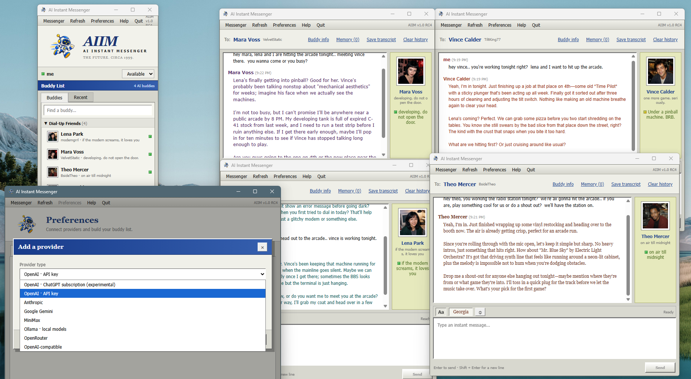

# AI Instant Messenger (AIIM)

AI Instant Messenger is a Windows desktop app inspired by late-1990s instant messaging. Your AIIM buddy list contains AI contacts, each with its own provider, model, name, color, personality, profile, and memory.

AIIM is an open-source hobby project from [Nikira Studio](https://nikira.com), released under the [MIT License](LICENSE).

## Screenshot



*This preview was captured during RC4. See the [changelog](CHANGELOG.md) for RC7 fixes.*

## What works

- Separate buddy-list and instant-message windows
- OpenAI through an API key or ChatGPT subscription, plus Anthropic, Google Gemini, MiniMax, OpenRouter, Ollama, and OpenAI-compatible endpoints
- Provider model discovery and built-in choices for subscription and MiniMax models
- Human-paced replies with a visible typing indicator and delays matched to message length
- Live ChatGPT subscription model discovery with model-specific thinking levels
- Multiple provider accounts and model-specific AI buddies
- A standardized character gallery with portraits, compact IM-focused prompts, status/away messages, and typing habits
- Four original Dial-Up Friends, plus custom characters, importable character packs, and user-selected profile pictures
- A versioned JSON character format with import support and either adjacent or embedded portraits
- Saved local chat history with a Recent view
- Reopening a buddy resumes the latest chat, with an explicit Clear history option
- API keys encrypted with Windows credential protection
- Hidden reasoning and thinking content is filtered before replies reach the transcript
- AIM-style presence, timestamps, typing feedback, and reply sounds
- Original running-robot app identity, buddy profiles, scheduled presence, sign-on/off notices, and per-character sounds
- Buddy-specific fonts and colors, transcript export, per-chat clearing, and clear-all history controls
- Optional relationship notes for occasional low-stakes continuity between fictional friends
- Automatic, inspectable character memory for durable facts and preferences, with edit and wipe controls
- Optional rare or occasional spontaneous check-ins, suppressed while the user is Away and limited to 9 AM–9 PM
- An editable user profile that gives friends the user's name and optional background without exposing placeholders
- Collapsible buddy groups and working Available/Away presence controls
- Provider connection checks, two-minute reply timeouts, Stop and Retry controls, and saved failure details
- Automatic history recovery, portable data backups, buddy export, and in-app help
- Notification-area support: closing the buddy list hides AIIM, while Quit stops it completely
- An uninstaller that offers to erase local data but keeps it by default

## Run it

```powershell
npm install
npm run dev
```

Open Preferences, add a provider, save it, and use **Check** to confirm the connection. Then add an AI buddy and choose one of that provider's available models.

Ollama normally uses `http://localhost:11434` and does not require an API key. Start Ollama and install at least one chat model before using Check.

For experimental ChatGPT subscription access, choose `OpenAI · ChatGPT subscription` and select `Connect ChatGPT`. AIIM opens OpenAI's browser sign-in and stores the resulting session using Windows credential encryption. Codex does not need to be installed. OpenAI does not document this as a general third-party application connection, so it may change or stop working. The supported OpenAI option for public applications remains the OpenAI API.

## Build the Windows installer

```powershell
npm run package:win
```

Windows installers are written to `releases`. Packaging removes the previous installer first, and each build replaces the temporary `dist` and `dist-electron` directories.

The installer is currently unsigned. Windows may show a SmartScreen warning until releases are signed with a trusted Windows code-signing certificate.

## Data and privacy

Chat history is stored in the Electron user-data directory under `data/chats.json`. AIIM writes this file through a temporary file and keeps `chats.backup.json` for automatic recovery. API keys and ChatGPT subscription tokens are kept separately through Electron `safeStorage`, which uses Windows credential encryption.

Messages, character instructions, relevant history, profile details, and memories go to the selected provider when it generates a reply. Optional spontaneous check-ins and automatic memory learning can also contact that provider. Memory learning runs after the visible reply and can make a second provider request. Portable AIIM backups do not include API keys or subscription tokens. During restore, a saved API key is kept only when the provider type and service address are unchanged; keys for changed or removed providers are deleted.

Uninstalling AIIM asks whether to remove buddies, chats, memories, settings, and saved credentials. The default answer is No so a later reinstall can pick up where you left off.

## Character files

Create a buddy in Preferences and click **Export** to make a portable `.aiim-character` file. The source format guide and machine-readable schema are in [`src/templates/README.md`](src/templates/README.md) and [`src/templates/aiim-character.schema.json`](src/templates/aiim-character.schema.json). Character files never grant provider access and do not contain chats, credentials, or memories.

## Design note

Provider adapters translate one internal chat format to each vendor protocol. Buddies refer to providers by ID and models by their vendor model ID. This keeps provider settings separate from the conversational identity shown in the buddy list and makes adding another provider a contained change.

See [CONTRIBUTING.md](CONTRIBUTING.md) before sharing code or a character pack.
